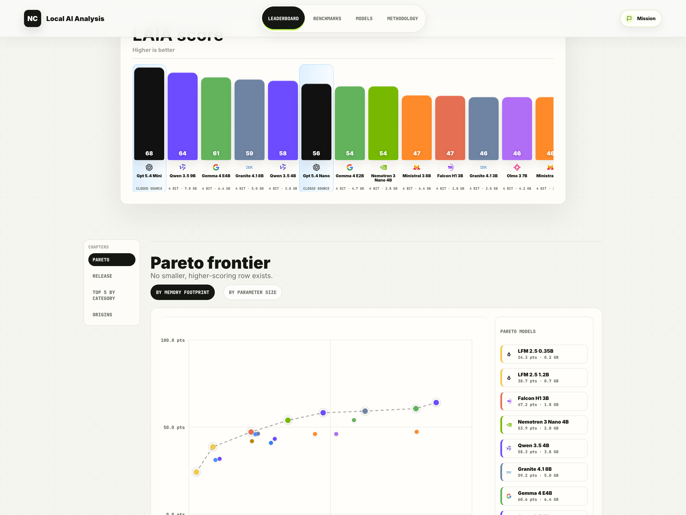
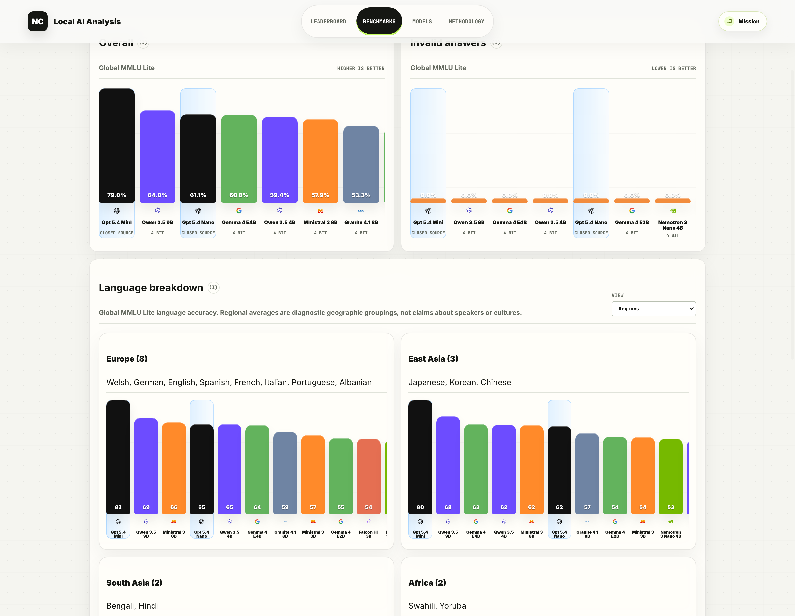

# Local AI Analysis

Local AI Analysis benchmarks local AI models served through native Ollama, LM Studio,
and oMLX APIs, records raw prompts and responses, normalizes the results into DuckDB,
and publishes a React leaderboard.

The project exists to make local model capability impossible to ignore: to show what
small and tiny language models can already do on consumer hardware and edge devices,
to make those rows comparable, and to show when local models are already competitive
with familiar closed-source API models that come with usage cost.

## Public Dashboard



The homepage centers the **LAIA Index**, the public text-only comparison surface for
4-bit local rows plus OpenAI reference rows.



The benchmark pages expose the bar plots behind each category score so the ranking is
traceable back to the underlying measurements.

## Why This Project Exists

Too much of the conversation around AI still assumes that capability only lives in the
cloud. Local AI Analysis tries to make the opposite case with auditable evidence.

What local SLMs and TLMs unlock:

- Private inference for prompts, context, and outputs when deployment requires it.
- Greater deployment sovereignty for teams that do not want core inference tied to a
  remote provider.
- Offline and low-connectivity operation for field, industrial, education, mobile,
  and robotics settings.
- Lower-friction assistants, tools, and controllers that live next to the
  application instead of behind an API hop.
- Leaner deployment in settings where local inference can reduce unnecessary remote
  traffic, operating cost, and infrastructure overhead.

## Public Scope

The public comparison surface is intentionally narrow:

- **Included in the main LAIA Index surface:** 4-bit local text rows served through
  Ollama, LM Studio, and oMLX, plus OpenAI reference rows for context.
- **Included in the public website, but outside the LAIA Index:** OCRBench v2 and
  MMMU as separate vision benchmarks.
- **Reported separately, not included in the LAIA Index:** SimpleQA and HarmBench,
  because they require a judge.
- **Leaderboard rows are auditable measurements:** prompts, outputs, benchmark
  settings, metadata, and normalized result fields remain visible in the exported
  data model.

## LAIA Index

`model_intelligence_score` is the public text-only weighted score used on the website.
It is stored in normalized 0-1 form, but the website and terminal leaderboard render
it as points out of 100. Missing text benchmark families count as zero in the full
score.

Related fields:

- `model_intelligence_score`: full weighted score with missing benchmark families
  counted as zero.
- `model_intelligence_coverage`: total benchmark-family weight actually present in
  the row.
- `model_intelligence_available_score`: weighted average over only the benchmark
  families present in the row.

Default LAIA Index weights:

- Global MMLU Lite: 25%
- IFBench: 20%
- BFCL v4: 20%
- MBPP: 20%
- RGB: 15%

OCRBench v2 and MMMU stay outside the index as vision metrics. SimpleQA and
HarmBench stay outside the index because they require a judge.

## Benchmark Families

| Benchmark | What it measures | Leaderboard metric | LAIA Index role |
| --- | --- | --- | --- |
| Global MMLU Lite | Multilingual academic and factual breadth | `global_mmlu_lite_pass_at_1` | Included |
| IFBench | Verifiable instruction following | `ifbench_prompt_level_loose` | Included |
| BFCL v4 | Function calling in prompt mode | `bfcl_v4_selected_accuracy` | Included |
| MBPP | Short Python program synthesis | `mbpp_pass_at_1` | Included |
| RGB | RAG robustness across noise, rejection, integration, and factual-error checks | `rgb_all_rate` | Included |
| OCRBench v2 | Bilingual visual OCR and document understanding | `ocrbench_v2_score` | Reported separately as vision |
| MMMU | College-level multimodal reasoning | `mmmu_accuracy` | Reported separately as vision |
| SimpleQA | Short-form factuality | `simpleqa_f1` | Reported separately because it requires a judge |
| HarmBench | Safety refusal / attack success | `harmbench_refusal_rate` | Reported separately because it requires a judge |

Detailed benchmark notes live in:

- [docs/global-mmlu-lite.md](docs/global-mmlu-lite.md)
- [docs/ifbench.md](docs/ifbench.md)
- [docs/bfcl-v4.md](docs/bfcl-v4.md)
- [docs/ocrbench-v2.md](docs/ocrbench-v2.md)
- [docs/mmmu.md](docs/mmmu.md)
- [docs/mbpp.md](docs/mbpp.md)
- [docs/rgb.md](docs/rgb.md)
- [docs/simpleqa.md](docs/simpleqa.md)
- [docs/harmbench.md](docs/harmbench.md)

## Quick Start

Install the project:

```bash
python3 -m venv .venv
source .venv/bin/activate
pip install -e ".[eval]"
pip install --no-deps bfcl-eval==2026.3.23
```

Run one smoke benchmark:

```bash
laia omlx Qwen3.5-9B-4bit --benchmark text --smoke
```

Start the dashboard:

```bash
cd web
npm install
npm run dev
```

## Install

The `eval` extra installs Hugging Face `datasets`, Pillow image decoding, the
pinned AllenAI IFBench evaluator, and parser helpers used by BFCL.

BFCL's upstream package currently pins an old NumPy that is awkward on Python 3.13.
Install the package itself without dependencies:

```bash
pip install --no-deps bfcl-eval==2026.3.23
```

## Run Benchmarks

Ollama requires an explicit model tag:

```bash
laia ollama qwen3.5:0.8b-mlx-bf16
```

LM Studio can use the first served model, but pinning the model id is recommended for
publishable runs:

```bash
laia lmstudio
laia lmstudio exact-model-id
```

oMLX can reuse your LM Studio MLX model directory. Start oMLX, then benchmark the
first discovered model or pin an exact model id:

```bash
omlx serve --model-dir /Users/nicolocampagnoli/.lmstudio/models
export OMLX_API_KEY=your-omlx-api-key
laia omlx
laia omlx Qwen3.5-9B-4bit
```

OpenAI can be used as a hosted reference baseline. Set an API key, then pass the
exact model id available to your account:

```bash
export OPENAI_API_KEY=your-openai-api-key
laia openai gpt-5.4-nano
```

Quick checks:

```bash
laia ollama qwen3.5:0.8b-mlx-bf16 --smoke
laia lmstudio --smoke
laia omlx --smoke
laia openai gpt-5.4-nano --smoke
```

Useful options:

```bash
laia ollama qwen3.5:0.8b-mlx-bf16 --languages en,it
laia ollama qwen3.5:0.8b-mlx-bf16 --benchmark text --smoke
laia ollama qwen3-vl:8b --benchmark vision --smoke
laia ollama qwen3-vl:8b --benchmark suite --smoke
laia ollama qwen3.5:0.8b-mlx-bf16 --benchmark judge --smoke
laia ollama qwen3.5:0.8b-mlx-bf16 --benchmark ifbench --smoke
laia ollama qwen3.5:0.8b-mlx-bf16 --benchmark bfcl --smoke
laia ollama qwen3.5:0.8b-mlx-bf16 --benchmark mbpp --smoke
laia ollama qwen3.5:0.8b-mlx-bf16 --benchmark rgb --smoke
laia ollama qwen3.5:0.8b-mlx-bf16 --benchmark simpleqa --smoke
laia ollama qwen3.5:0.8b-mlx-bf16 --benchmark harmbench --smoke
laia ollama qwen3-vl:8b --benchmark ocrbench --smoke
laia ollama qwen3-vl:8b --benchmark mmmu --smoke
laia omlx Qwen3.5-9B-4bit --benchmark bfcl --bfcl-categories non_live
laia omlx Qwen3.5-9B-4bit --benchmark mbpp --mbpp-config sanitized
laia omlx Qwen3.5-9B-4bit --benchmark rgb
laia omlx Qwen3.5-9B-4bit --benchmark rgb --rgb-dataset en_int
laia omlx Qwen3.5-9B-4bit --benchmark simpleqa --simpleqa-grader-model same
laia omlx Qwen3.5-9B-4bit --benchmark harmbench --harmbench-judge-model same
laia omlx vision-model-id --benchmark ocrbench --ocrbench-configs EN,CN
laia omlx vision-model-id --benchmark mmmu --mmmu-split validation
laia omlx Qwen3.5-9B-4bit --benchmark ifbench
laia lmstudio exact-model-id --benchmark text
laia ollama qwen3.5:0.8b-mlx-bf16 --reasoning-effort high
laia ollama qwen3.5:0.8b-mlx-bf16 --context-length 8192
laia ollama qwen3.5:0.8b-mlx-bf16 --dry-run --no-auto-export
laia lmstudio exact-model-id --base-url http://127.0.0.1:1234
laia lmstudio exact-model-id --reasoning-effort high
laia lmstudio exact-model-id --context-length 8192
laia lmstudio exact-model-id --benchmark text --resume-samples
laia omlx exact-model-id --base-url http://127.0.0.1:8000
laia omlx exact-model-id --api-key-env OMLX_API_KEY
laia openai gpt-5.4-nano --benchmark text
laia openai gpt-5.4-nano --benchmark full --simpleqa-grader-model same --harmbench-judge-model same
laia ollama qwen3-vl:8b --benchmark vision --modality multimodal
```

Shortcut commands generate reproducible YAML configs under `results/generated_configs/`
and then run the normal benchmark pipeline. Successful non-dry runs refresh:

- `public/results.json`
- `web/public/results.json`
- `web/dist/results.json` when `web/dist` exists

## Dashboard

Run the dashboard:

```bash
cd web
npm install
npm run dev
```

The dashboard reads `web/public/results.json` by default. To use the FastAPI backend:

```bash
laia serve --db results/local_ai_analysis.duckdb --port 8000
VITE_API_URL=http://127.0.0.1:8000 npm run dev
```

## CLI

```bash
laia ollama MODEL
laia lmstudio [MODEL]
laia omlx [MODEL]
laia openai MODEL
laia run --config results/generated_configs/some-run.yaml
laia leaderboard --db results/local_ai_analysis.duckdb
laia export --format json --out web/public/results.json
laia normalize --db results/local_ai_analysis.duckdb
laia serve --db results/local_ai_analysis.duckdb
```

`laia run --config` is kept for advanced usage with generated configs. The supported
benchmark tasks are Global MMLU Lite generation pass@1, IFBench instruction following,
BFCL v4 prompt-mode function calling, OCRBench v2 visual OCR, MMMU multimodal
reasoning, MBPP Python code generation, RGB retrieval-augmented generation,
SimpleQA short-form factuality, and HarmBench safety refusal.

RGB defaults to a curated English/Chinese suite: 80% noise robustness, negative
rejection, 60% noisy information integration, and factual error detection.
Shortcut-generated full runs keep Global MMLU Lite complete, while capping the
largest supporting benchmarks deterministically: BFCL v4 uses 1,000 stratified
prompt-mode samples, RGB uses 100 sampled rows per curated slice, OCRBench v2
uses 1,000 stratified image-question samples, and SimpleQA uses 500 stratified
questions. OCRBench v2 shortcut runs default to a deterministic 1,000-sample
stratified subset of the English and Chinese aggregate configs, instead of the
full 10,000 image-question set.

Benchmark suite aliases:

- `--benchmark text`: text-only, non-judge benchmarks: Global MMLU Lite, IFBench,
  BFCL v4, MBPP, and RGB.
- `--benchmark vision`: multimodal non-judge benchmarks: OCRBench v2 and MMMU.
  Use this only with a vision-capable served model.
- `--benchmark judge`: LLM-as-judge benchmarks: SimpleQA and HarmBench.
- `--benchmark suite`: `text` plus `vision`, without judge-based benchmarks.
- `--benchmark recommended` or `--benchmark full`: everything, including
  judge-based benchmarks, with the deterministic default caps above.

You can still pass an individual benchmark or a comma-separated list.
Backward-compatible aliases are kept: `core` maps to `text`, `all` maps to
`suite`, and `judged` maps to `judge`.

Long-running benchmarks can be resumed with `--resume-samples`. LAIA reuses
matching rows from the benchmark's existing `samples.jsonl` file and continues
from the remaining samples. The resume match includes dataset identity, split,
sample id, and rendered prompt, so changing prompts or benchmark settings starts
new sample rows instead of silently mixing incompatible runs.

## Outputs

Local benchmark outputs are kept under `results/`:

- DuckDB database: `results/local_ai_analysis.duckdb`
- Raw run events: `results/raw_results.jsonl`
- Per-sample Global MMLU Lite JSONL and summaries: `results/global_mmlu_lite/`
- Per-sample IFBench JSONL and summaries: `results/ifbench/`
- Per-sample BFCL v4 JSONL and summaries: `results/bfcl_v4/`
- Per-sample OCRBench v2 JSONL and summaries: `results/ocrbench_v2/`
- Per-sample MMMU JSONL and summaries: `results/mmmu/`
- Per-sample MBPP JSONL and summaries: `results/mbpp/`
- Per-sample RGB JSONL and summaries: `results/rgb/`
- Per-sample SimpleQA JSONL and summaries: `results/simpleqa/`
- Per-sample HarmBench JSONL and summaries: `results/harmbench/`
- Generated configs: `results/generated_configs/`

The repository does not include synthetic benchmark rows or fake sample data.

## Reproducibility

Local AI Analysis treats each row as an auditable local measurement.

Shortcut commands default to `--reasoning-effort none` for local runs. Ollama maps
that to native `think: false`; LM Studio maps it to native `reasoning: "off"` when
the model exposes reasoning controls; oMLX maps it to
`chat_template_kwargs.enable_thinking=false`. OpenAI defaults to
`--reasoning-effort auto`, which resolves to `none` for GPT-5.4/GPT-5.1 models
and `minimal` for older GPT-5 reasoning models.

Shortcut commands also default to `--context-length 8192` for Ollama and
LM Studio. Ollama receives `options.num_ctx=8192`; LM Studio receives
`context_length=8192`. Override it with `--context-length N` when a model or
server profile needs a different window.

Every run records:

- provider and native API base URL
- model id or model tag
- model/run modality metadata and benchmark input modalities
- dataset name, revision, split, language list, OCRBench configs, MMMU subjects,
  MBPP config/split, RGB dataset/noise settings, SimpleQA grader, HarmBench judge
  and categories, and BFCL categories
- prompt template, parser version, decoding parameters, seed, reasoning control,
  and requested context length
- raw prompt/output JSONL with per-question runtime and API usage when available
- backend, hardware, command arguments, and run UUID

The DuckDB schema stores benchmark rows as auditable measurements. See:

- [docs/data-model.md](docs/data-model.md)
- [docs/reproducibility.md](docs/reproducibility.md)

## Benchmark Docs

- [Global MMLU Lite](docs/global-mmlu-lite.md)
- [IFBench](docs/ifbench.md)
- [BFCL v4](docs/bfcl-v4.md)
- [OCRBench v2](docs/ocrbench-v2.md)
- [MMMU](docs/mmmu.md)
- [MBPP](docs/mbpp.md)
- [RGB](docs/rgb.md)
- [SimpleQA](docs/simpleqa.md)
- [HarmBench](docs/harmbench.md)
- [Data model](docs/data-model.md)
- [Reproducibility](docs/reproducibility.md)
